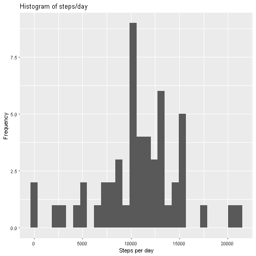
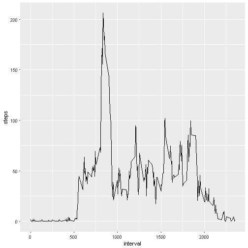
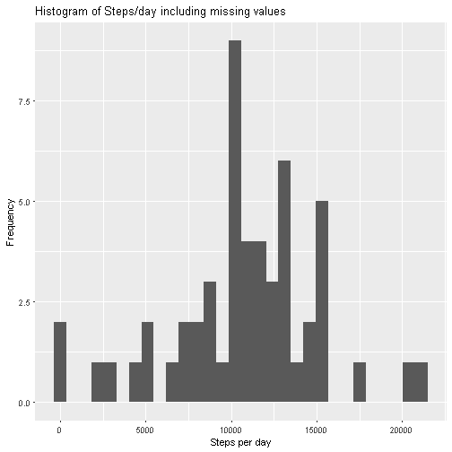
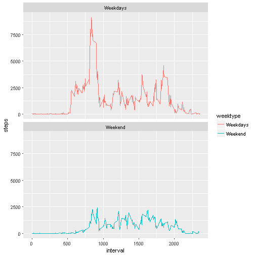

```r
knitr::opts_chunk$set(echo = TRUE)
```

## Introduction

It is now possible to collect a large amount of data about personal movement using activity monitoring devices such as a Fitbit, Nike Fuelband, or Jawbone Up. These type of devices are part of the “quantified self” movement – a group of enthusiasts who take measurements about themselves regularly to improve their health, to find patterns in their behavior, or because they are tech geeks. But these data remain under-utilized both because the raw data are hard to obtain and there is a lack of statistical methods and software for processing and interpreting the data.

This assignment makes use of data from a personal activity monitoring device. This device collects data at 5 minute intervals through out the day. The data consists of two months of data from an anonymous individual collected during the months of October and November, 2012 and include the number of steps taken in 5 minute intervals each day.

### Loadiing the data


```r
MyData <- read.csv(file="activity.csv", header=TRUE, sep=",")
```

####Calculate the total number of steps taken per day

1. Calculate the total number of steps taken per day
2. If you do not understand the difference between a histogram and a barplot, research the difference between them. 4. Make a histogram of the total number of steps taken each day


```r
library(ggplot2)
fdata<-aggregate(steps~date,MyData,sum)
ggplot(fdata, aes(x=steps))+geom_histogram()+
labs(title="Histogram of steps/day", x="Steps per day", y="Frequency")
```

```
## `stat_bin()` using `bins = 30`. Pick better value with `binwidth`.
```



#### Calculate and report the mean and median of the total number of steps taken per day


```r
meansteps<-mean(fdata$steps, na.rm = TRUE)
mediansteps<-median(fdata$steps, na.rm = TRUE)
meansteps
```

```
## [1] 10766.19
```

```r
mediansteps
```

```
## [1] 10765
```

### What is the average daily activity pattern

1. Make a time series plot (i.e. type = "l") of the 5-minute interval (x-axis) and the average number of steps taken, averaged across all days (y-axis)
2. Which 5-minute interval, on average across all the days in the dataset, contains the maximum number of steps?


```r
#make the time series plot for 5 min interval with average no. of steps
fdata2<-aggregate(steps~interval,MyData,mean)
ggplot(fdata2, aes(x=interval, y=steps))+geom_line()
```



```r
#Maximum steps on average across all the days
fdata2[fdata2$steps==max(fdata2$steps), ]
```

```
##     interval    steps
## 104      835 206.1698
```

###Imputing missing values
1. Calculate and report the total number of missing values in the dataset (i.e. the total number of rows with NAs)
2. Devise a strategy for filling in all of the missing values in the dataset. The strategy does not need to be sophisticated. For example, you could use the mean/median for that day, or the mean for that 5-minute interval, etc.
3. Create a new dataset that is equal to the original dataset but with the missing data filled in.
4. Make a histogram of the total number of steps taken each day and Calculate and report the mean and median total number of steps taken per day. Do these values differ from the estimates from the first part of the assignment? What is the impact of imputing missing data on the estimates of the total daily number of steps?


```r
#calculate the total number of missing values
sum(is.na(MyData))
```

```
## [1] 2304
```

```r
#fill the missing values with the mean
MyDataNew<-MyData
#avginterval<-mean(MyData$interval, na.rm = TRUE)
#MyDataNew$steps[is.na(MyDataNew$steps)]<-avginterval

d<-replace(MyDataNew$steps, is.na(MyDataNew$steps), meansteps)


#Histogram and mean and median of new data
fdataNew<-aggregate(steps~date,MyDataNew,sum)
ggplot(fdataNew, aes(x=steps))+geom_histogram()+
  labs(title="Histogram of Steps/day including missing values", x="Steps per day", y="Frequency")
```

```
## `stat_bin()` using `bins = 30`. Pick better value with `binwidth`.
```



```r
meanstepsNew<-mean(fdataNew$steps, na.rm = TRUE)
medianstepsNew<-median(fdataNew$steps, na.rm = TRUE)
meanstepsNew
```

```
## [1] 10766.19
```

```r
medianstepsNew
```

```
## [1] 10765
```

There is no impact on mean and median of the data after imputing missing data with mean/median value of the data.It is still same 

### Are there differences in activity patterns between weekdays and weekends?

For this part the weekdays() function may be of some help here. Use the dataset with the filled-in missing values for this part.

1. Create a new factor variable in the dataset with two levels – “weekday” and “weekend” indicating whether a given date is a weekday or weekend day.
2. Make a panel plot containing a time series plot (i.e. type = "l") of the 5-minute interval (x-axis) and the average number of steps taken, averaged across all weekday days or weekend days (y-axis). See the README file in the GitHub repository to see an example of what this plot should look like using simulated data.


```r
library(lubridate)
library(dplyr)
Sys.setlocale("LC_TIME", "English")
```

```
## [1] "English_United States.1252"
```

```r
MyDataNew<-MyData
MyDataNew$date<-ymd(MyDataNew$date)
MyDataNew<-mutate(MyDataNew, weektype=ifelse(weekdays(MyDataNew$date)=="Saturday" | weekdays(MyDataNew$date)=="Sunday", "Weekend", "Weekdays"))
MyDataNew$weektype<-as.factor(MyDataNew$weektype)

fdataWeek<-aggregate(steps~interval+weektype,MyDataNew,sum)
ggplot(fdataWeek, aes(x=interval,y=steps, color=weektype))+
  geom_line()+
  facet_wrap(~weektype, ncol=1, nrow=2)
```



From the two types of plots, it is obvious tha object is more active during the weekdays in comaprisn to weekends.
